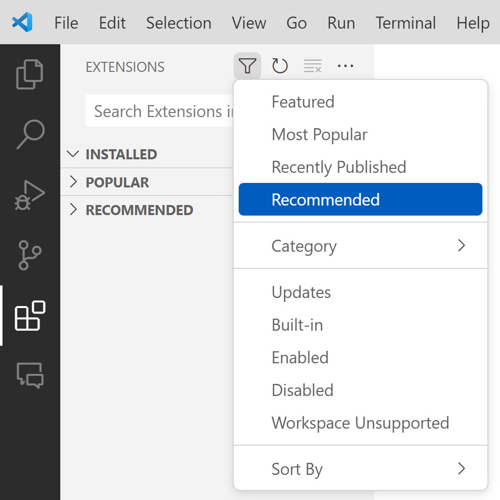
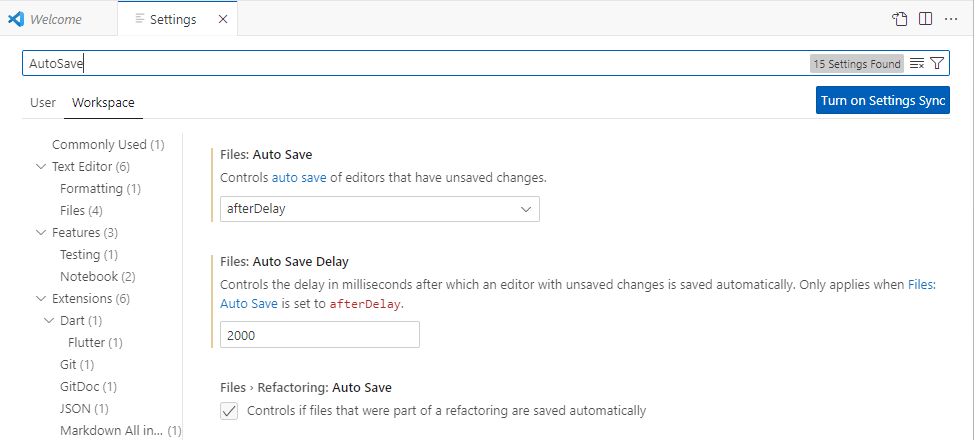

# GitDoc Usage

> **Your Name Here**

> Use this repository as a test that you have the correct settings in [Visual Studio Code](https://code.visualstudio.com/) for using [GitDoc](https://aka.ms/gitdoc) in your school projects.

Follow the instructions below to ensure that you have Visual Studio Code correctly set up for this repository.

When you think you have GitDoc set up, try putting your name in the area indicated above. You should see

- VS Code auto-save your file, and
- (in a few seconds) auto-commit the changes with a time stamp, and finally
- (in 5 minutes) auto-push your changes to GitHub

Keep making changes to this repository. Add files, edit files, etc. All your work will be recorded, and there will be a clear demonstration of the efforts you have put into your project/assignment.

----

## Automatic Commits

**NOTE:** VS Code AutoSave and GitDoc have been enabled for this repository; ***do not turn this off***. Check your settings to ensure that you have *GitDoc* as well as *AutoSave* for VS Code enabled for this lab.

This repository is set up with **recommended extensions**. When you open it in Visual Studio Code, you should be prompted to install these extensions. To manually check what is installed, see the Extensions panel in VS Code and filter for "Recommended".



To manually turn on AutoSave for VS Code, check your settings for the text `AutoSave` and be sure that they have been correctly applied to your *Workspace* settings.

| File -> Settings                   | AutoSave                                    |
| ---------------------------------- | ------------------------------------------- |
|  |  |

To manually enable GitDoc, press <kbd>F1</kbd>, type `GitDoc: Enable` and press <kbd>Enter</kbd>.


> **Note:** If you do *not* see `GitDoc` in the list of options, you may need to install the extension. Press <kbd>F1</kbd>, type `Extensions: Install Extensions` and press <kbd>Enter</kbd>. Search for `GitDoc` and install it.

Also make sure that you have set the Commit Validation Level to `none` in your workspace settings.

| File -> Settings                   | Commit Validation Level                         |
| ---------------------------------- | ----------------------------------------------- |
|  |  |


Ensure that git knows your username and email. You can find out if it is configured on your computer by running the following commands in the terminal.

```ps
git config --global user.name
git config --global user.email
```

If there is no information on your user name or email in the git configuration, run the following code, replacing the username and email information with your personal information.

```ps
git config --global user.name "Your Full Name"
git config --global user.email "YourSchoolEmail@nait.ca"
```

----
